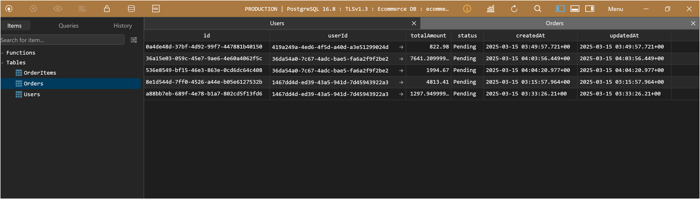
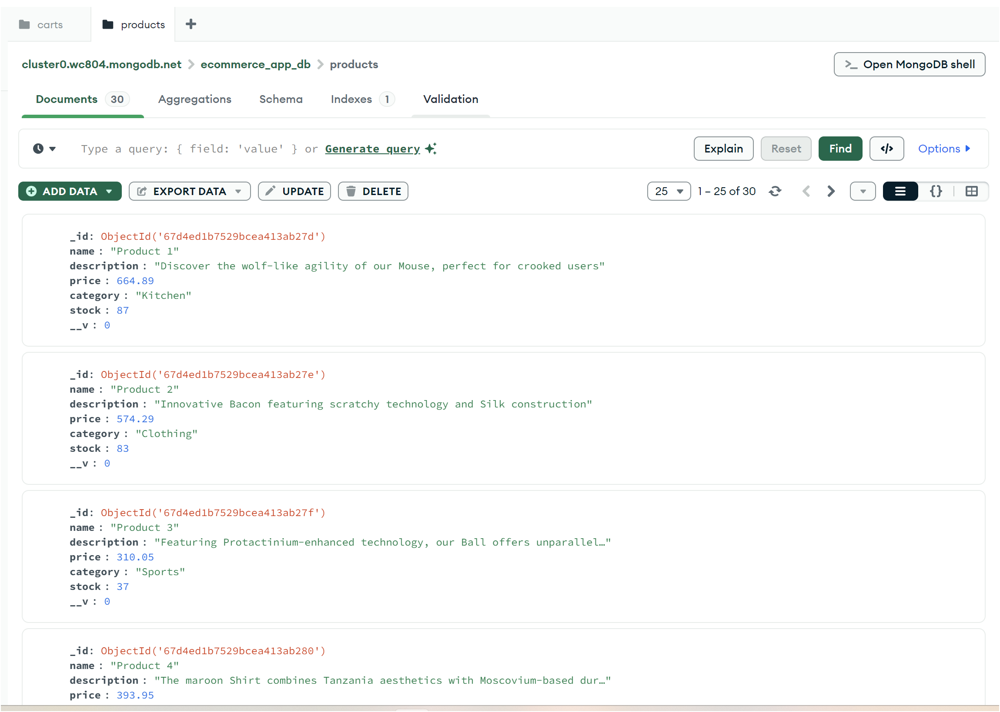

**README**

**ECOMMERCE APP**: FullStackExamMukul15-03-2025

**Project Overview**

Tech Stack : 
* Frontend : Next JS 
* Backend : Node , Express , MongoDB ,POSTGRES

**Deployed on** : 
* Frontend : https://ecommerce-app-7y4r.vercel.app/
* Backend : https://ecommerce-app-hob4.onrender.com

**Getting Started**

1. Clone the repository: `git clone https://github.com/mukuldata/FullStackExamMukul15-03-2025`
2. cd backend 
2. Install dependencies: `npm install`
3. Create a `.env` file and add the following environment variables from .env.sample
4. Start the server: `npm start`
5. Seed data in mongodb (Products and category) using src/utils/seed.js (node run seed.js)

For Frontend :
1. cd frontend
2. Install dependencies: `npm install`
3. Create a `.env` file and add the following environment variables from .env.sample
4. Start the server: `npm start`

**Project Structure**

* Backend Architecture

* `src`: Source code directory
	+ `config`: Configuration files (e.g: database (mongodDB and sql))
	+ `controllers`: Controller files (e.g: auth, cart, order,product,report)
	+ `models`: Model files 
       + `mongo` : (eg: cart, product)
       + `sql` : (eg : order , user orderItem)
	+ `routes`: Route files (e.g : auth,cart,order,product,report)
	+ `utils`: Utility files (e.g: helper,seed)
    + `server.js `: Entry point
    + `app.js` : Handle routes and server creation
* `package.json`: Project dependencies and scripts

**Workflow**

Here's an overview of the workflow:

* All routes are protected with middleware that checks for cookie that is created on Login time.
* Only admin can view reports data (Manully added in DB ,role as admin  for a user)

1. **User Registration**:
	* User sends a `POST /api/auth/register` request with their name , email and password.
	* The server creates a new user document in the SQL database and saves a hashed password .
	* The server returns a success response to the user.
2. **User Login**:
	* User sends a `POST /api/auth/login` request with their email and password.
	* The server verifies the user's credentials and creates a new JWT access token.
    * The JWT stored in cookie valid for  1 hr(in config)
3.  **Product View**
    * User can view products and distinct category in MongoDB (Products collection).  
      `GET /api/products?page=3` , `GET /api/products/categories`
    * The server returns products based on query. 
    * Pagination applied based on query
4. **View Products**:
	* User select on Product. Redirected to Product details page. 
     `GET api/products/:productId`
	* Option of add to cart and view cart is shown to user 

5. **Add to cart**:
	* User selects quantity (less than 5 allowed)  `POST /api/cart/add`
	* A document created in MongoDB in cart collection.

6. **View Cart**:
	* User selects view cart. `GET /api/cart/view`
    * Cart details for user fetched from MongoDB
    * If quantity is increase updated quantity in cart else added a new document.
7. **Delete Cart**:
	* User selects delete cart `POST /api/cart/remove`
    * Cart details deleted from mongoDB 

8. **Checkout**:
	*  User select Checkout option `POST /api/orders/checkout`
    * The details from cart collection per user taken from MongoDB
    * Order Table and Order Item table is created in SQL DB 
    * After success, cart is deleted from MONGODB 
    * If order table creation sucess, Success in shown on UI with order ID.

9. **Order History**:
	* User select View Order option `POST /api/orders/history`
    * The details from cart Order and Order Item table for SQL 
    * The Product name and category fetched from MongoDB 
    * The order details are grouped to show in UI.

10. **Logout**
    * User select Logout option, `POST /api/auth/logout`
    * The cookie is removed from frontend 
    * No route can be accessed after logout .
    * User redirected to Login page.

11. **Reports**
    * `GET /api/reports/revenue-stats` , `GET /api/reports/top-senders` , `GET /api/reports/sales-by-category`
    * These routes are accessible for admin role.
    * To view reports in frontend :
      1. Use email :   `mukul@gmail.com` and password : `password`
    * The routes uses aggregation and complex queries to group and fetch data from mongodb and sql

**IMPLEMENTATION**
**To view workflow**

Google drive : https://drive.google.com/file/d/1EURTNG3OHVVDc0g2YsT0AuwdXSrnmDzO/view

**SQL DB view**

**MONGO DB View**

